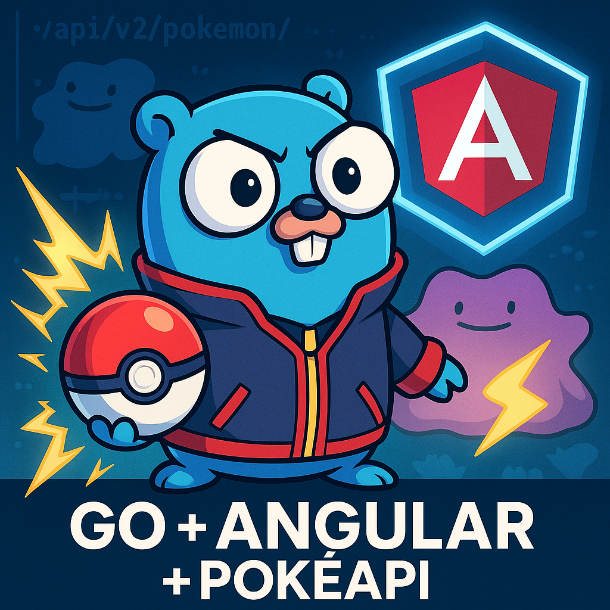

# gokemon-back



# PokéAPI Wrapper in Go + Gin

This project is a **Golang wrapper** around the official [PokéAPI](https://pokeapi.co/), built with the [Gin](https://github.com/gin-gonic/gin) framework.  
It provides a clean, fast, and extensible layer to fetch and expose Pokémon data, making it easy to integrate with modern front-end frameworks like Angular, React, or Vue.

## ✨ Features
- Fetch Pokémon details by **name or ID**  
  Example: `/pokemon/ditto` or `/pokemon/132`  
- Strongly typed **Go structs** stored in the `dto/` directory.  
- Clear separation of responsibilities (`dto/`, `servs/`, `main.go`).  
- **CORS support** for web-based front-end consumption.  
- Built-in **error handling and request timeouts** using `context.Context`.  

## 🚀 Tech Stack
- **Go** (1.22+)  
- **Gin Gonic** – lightweight and fast HTTP framework  
- **PokéAPI** – official Pokémon data source  
- **Go modules** – package and dependency management  

## 📂 Project Structure
```
project/
 ├── dto/        # Domain structs (models)
 │    └── pokemon.go
 ├── servs/      # Services (external requests, business logic)
 │    └── pokemon.go
 ├── main.go     # Application entrypoint and route configuration
 ├── go.mod
 └── go.sum
```

## 🔧 Usage
### Installation
```bash
git clone https://github.com/yourusername/pokeapi-gin.git
cd pokeapi-gin
go mod tidy
```

### Run
```bash
go run main.go
```

The API will be available at `http://localhost:8080`.

### Example Endpoints
- **Get Pokémon by name/ID**  
  ```
  GET /pokemon/ditto
  GET /pokemon/25
  ```

Response:
```json
{
  "id": 132,
  "name": "ditto",
  "height": 3,
  "weight": 40,
  "species": {
    "name": "ditto",
    "url": "https://pokeapi.co/api/v2/pokemon-species/132/"
  }
}
```

#### author **Marcos Eduardo**